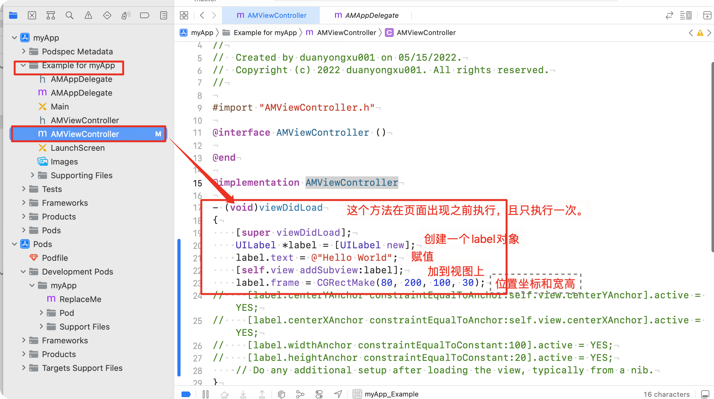
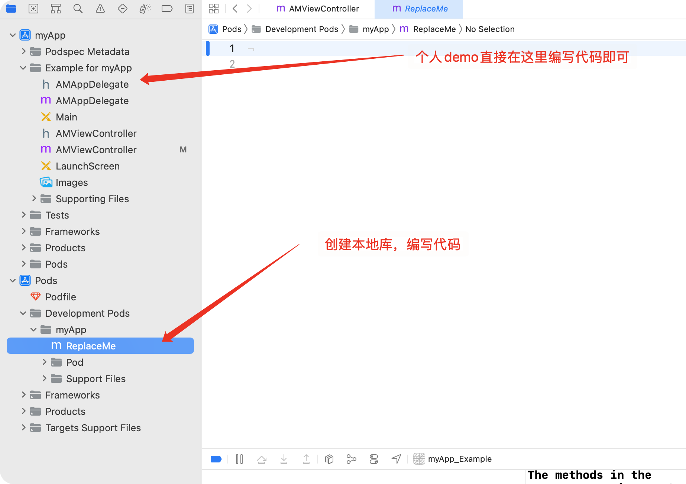
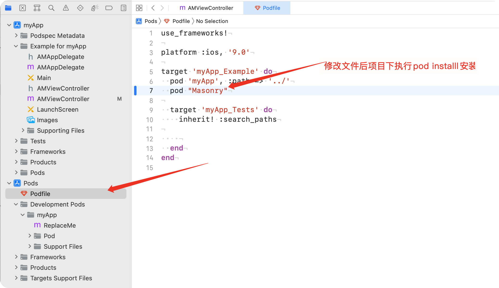

<!--  -->

[toc]
# 准备环境

## 安装Xcode
> Xcode 在应用商店下载即可，可能产生系统版本低的情况，如果无法安装先升级系统版本。

## 安装包管理工具cocoapods
1. 安装ruby.
2. 安装gem   (在命令行中查找安装升级卸载软件包的工具，类似npm)
3. 安装cocoapods  
```sh
sudo gem install cocoapods  
```

**注意：** 下载安装cocoapods 时可能会比较慢，可以对gem的源进行替换。

# 创建一个新项目
1. 创建一个新目录存放项目
```sh
mkdir demo && cd demo
```
2. 使用命令创建项目模板
```sh
pod lib create myApp

```
创建模板过程中有几个选项需要我们选择：
   1. What platform do you want to use?? [ iOS / macOS ]   iOS
   2. What language do you want to use?? [ Swift / ObjC ]  ObjC
   3. Would you like to include a demo application with your library? [ Yes / No ]   Yes
   4. Which testing frameworks will you use? [ Specta / Kiwi / None ]   None
   5. Would you like to do view based testing? [ Yes / No ]  No
   6. What is your class prefix?    项目文件的前缀名，自己写就好  AM

## demo编写



## 项目结构



## 安装第三方库
